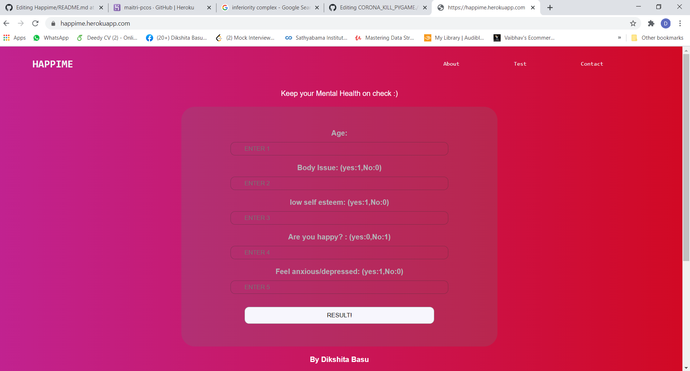

# Happime
A web app to test whether you have inferiority complex.

#INFERIORITY COMPLEX

Inferiority complex is a term used to describe people who compensate for feelings of inferiority (feeling like they're less than other people, not as good as others, worthless, etc.) by acting in ways that make them appear superior. They do this because controlling others may help them feel less personally inadequate.

#TECH STACK USED
Libraries used : Numpy, pandas, matplotlib, linear regression, sklearn
Front-end: HTML, CSS
Backend : Flask

Deployed in Heroku.

#STEPS TO RUN IN LOCALHOST:
1. Create a virtual environment using command prompt, and then type workon -'environment name'.
2. Navigate to the location where you downloaded the project using 'cd'
3. Type python app.py

